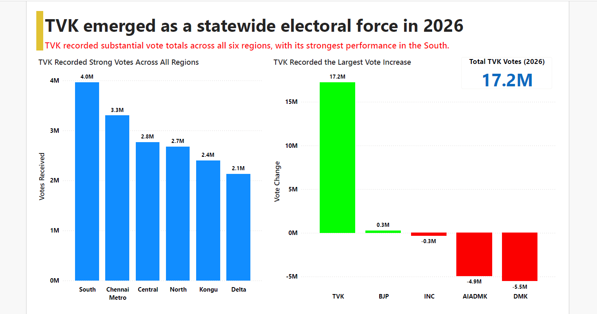

# Tamil Nadu Election Analysis Project

Analytical storytelling project comparing Tamil Nadu elections (2021 vs 2026) using Python, Plotly, and Power BI.

---

## Project Overview

This project analyzes how Tamil Nadu’s political landscape changed between the 2021 and 2026 assembly elections using constituency-level and regional-level election data.

The analysis focuses on:
- Regional political fragmentation
- Constituency volatility
- Vote redistribution
- TVK’s statewide emergence

The project was designed as a storytelling-focused analytical presentation inspired by newsroom-style election coverage.

---

## Tools Used

- Python
- Pandas
- Plotly
- Power BI

---

## Key Insights

### Regional Political Fragmentation
Regional dominance became more fragmented in 2026, with stronger competition across Tamil Nadu.

### Constituency Volatility
163 constituencies changed hands between elections, indicating substantial electoral movement.

### TVK Emergence
TVK established measurable statewide presence and recorded strong performances across all six regions.

---

## Methodology

1. Data Collection
2. Data Cleaning & Preparation
3. Election Comparison
4. Regional & Vote Analysis
5. Dashboard Storytelling

---

## Data Sources

- Election Commission of India (ECI)
- Publicly available Tamil Nadu Assembly election datasets

## Reproduction Steps

1. Load election datasets into Python
2. Clean and prepare constituency-level data using Pandas
3. Perform regional and vote-share analysis
4. Create exploratory visualizations using Plotly
5. Build storytelling dashboards in Power BI
6. Export visuals and presentation assets

## Dashboard Preview

### Regional Political Landscape


### Constituency Shifts


### Vote Share Dynamics



---

## Project Presentation

(Add PPT/PDF/video links here later)

## Project Presentation

- [Presentation Deck (PPT)](presentation/TN_Election_Storytelling_Deck.pptx)
- [Presentation Deck (PDF)](presentation/TN_Election_Storytelling_Deck.pdf)

---

## Interactive Dashboard

[View Interactive Power BI Dashboard](<iframe title="TamilNadu_2026_Election_Insights" width="600" height="373.5" src="https://app.powerbi.com/view?r=eyJrIjoiMWJhOWQ5MmUtM2Q4OS00MTQxLThlZTktYTljZmZmMzU4YzYzIiwidCI6ImM2ZTU0OWIzLTVmNDUtNDAzMi1hYWU5LWQ0MjQ0ZGM1YjJjNCJ9&pageName=6e009399b110941fbeef" frameborder="0" allowFullScreen="true"></iframe>)

## Repository Structure

```text
Tamil-Nadu-Election-Analysis-Project/
│
├── notebooks/
├── dashboard_screenshots/
├── presentations/
├── README.md
└── LICENSE
```

## Conclusion

The 2026 Tamil Nadu election reflected a transition toward a more competitive and fragmented political landscape, accompanied by significant constituency-level volatility and the emergence of TVK as a statewide electoral force.

## Author

Anurag Gupta
