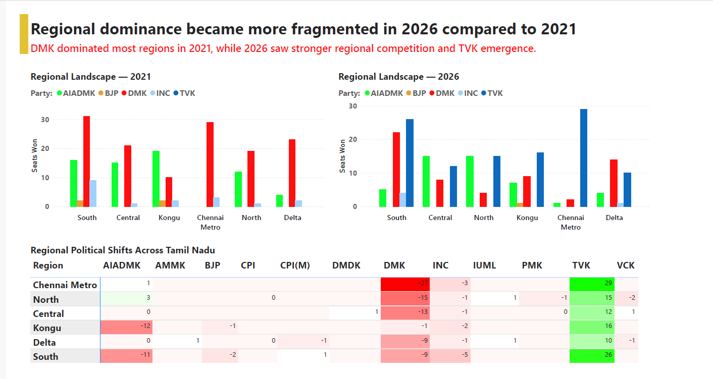
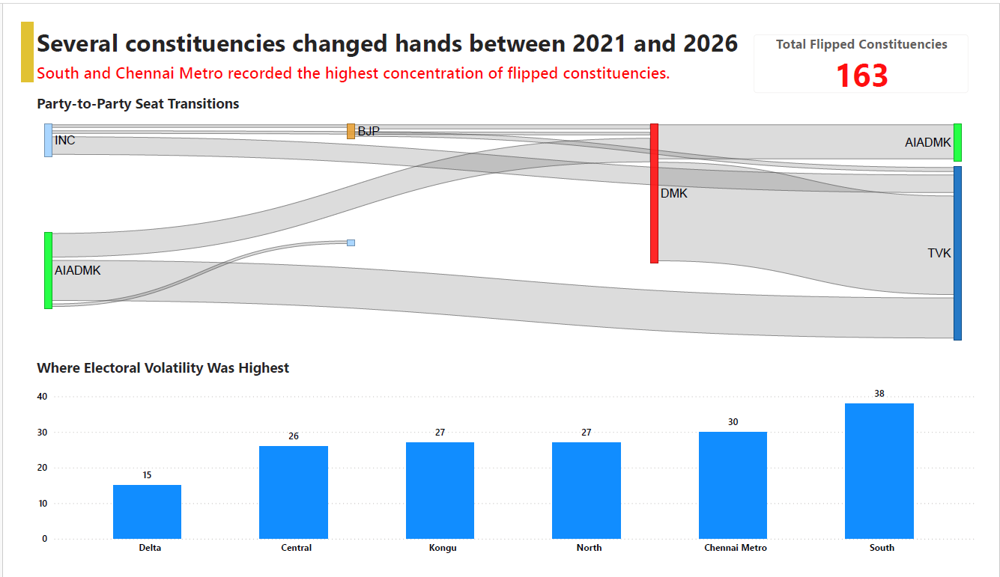

# Tamil Nadu Election Analysis Project

Analytical storytelling project comparing Tamil Nadu elections (2021 vs 2026) using Python, Plotly, and Power BI.

---

## Project Overview

This project analyzes how Tamil Nadu’s political landscape changed between the 2021 and 2026 assembly elections using constituency-level and regional-level election data.

The analysis focuses on:
- Regional political fragmentation
- Constituency volatility
- Vote redistribution
- TVK’s statewide emergence

The project was designed as a storytelling-focused analytical presentation inspired by newsroom-style election coverage.

---

## Tools Used

- Python
- Pandas
- Plotly
- Power BI

---

## Key Insights

### Regional Political Fragmentation
Regional dominance became more fragmented in 2026, with stronger competition across Tamil Nadu.

### Constituency Volatility
163 constituencies changed hands between elections, indicating substantial electoral movement.

### TVK Emergence
TVK established measurable statewide presence and recorded strong performances across all six regions.

---

## Methodology

1. Data Collection
2. Data Cleaning & Preparation
3. Election Comparison
4. Regional & Vote Analysis
5. Dashboard Storytelling

---

## Dashboard Preview

---

## Project Presentation

(Add PPT/PDF/video links here later)

[TN_Election_Storytelling_Deck.pptx](https://github.com/user-attachments/files/28312522/TN_Election_Storytelling_Deck.pptx)

[TN_Election_Storytelling_Deck.pdf](https://github.com/user-attachments/files/28312521/TN_Election_Storytelling_Deck.pdf)

---

## Conclusion

The 2026 Tamil Nadu election reflected a transition toward a more competitive and fragmented political landscape, accompanied by significant constituency-level volatility and the emergence of TVK as a statewide electoral force.
